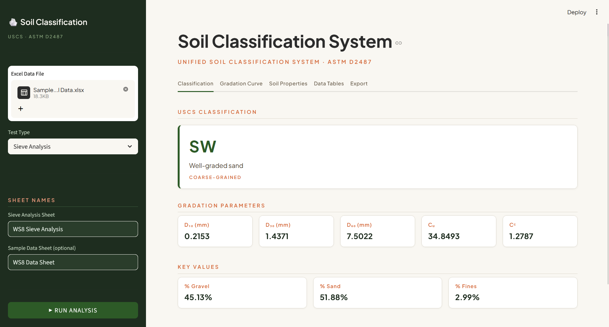

# Soil Classification System

A Python-based geotechnical laboratory tool for processing and classifying soils according to the 
**Unified Soil Classification System (USCS) · ASTM D2487**. Supports sieve analysis, hydrometer analysis, and 
Atterberg limits testing, with both a command-line interface and an interactive Streamlit web app.




---

## Features

- **Supports three types of test data** — sieve analysis, hydrometer analysis, and Atterberg limits testing
- **Full USCS classification** — coarse-grained (gravel/sand), fine-grained (silt/clay), and highly organic (peat) soils, including dual symbols and borderline cases
- **Gradation curve plots** — log-scale particle size distribution with D₁₀, D₃₀, D₆₀ markers and drop lines
- **Casagrande plasticity chart** — A-line, U-line, zone labels, CL-ML hatched zone, and sample marker
- **Computed soil properties** — bulk density, unit weight, moisture content, void ratio, and porosity
- **Excel export** — download all processed tables as a multi-sheet `.xlsx` workbook
- **Dual interface** — run from the terminal via `main.py` or interactively via the Streamlit app

---

## Requirements

- Python 3.10+
- pandas
- numpy
- plotly
- streamlit
- openpyxl

Install all dependencies with:

```bash
pip install pandas numpy plotly streamlit openpyxl
```

---

## Usage

### Streamlit App

```bash
streamlit run app.py
```

1. Upload your Excel data file in the sidebar.
2. Select the test type (Sieve Analysis, Hydrometer Analysis, or Atterberg Limits).
3. Enter the relevant sheet names.
4. Click **▶ RUN ANALYSIS**.

Results are displayed across tabbed panels: Classification, Gradation Curve or Casagrande Chart, Soil Properties, Data Tables, and Export.

### Command-Line Interface

```bash
python main.py
```

Follow the prompts to enter the file path, select the test type, and provide sheet names. The USCS classification and soil properties are printed to the terminal.

---

## Input Format

All input data is read from a single `.xlsx` Excel file. Each test type expects a specific sheet layout with named table sections stacked vertically — each table preceded by a title row whose first cell contains the table name.

### Sieve Analysis

**Sieve sheet** — three stacked tables:

| Table title | Header row | Key columns |
|---|---|---|
| Experimental Mass | No | Description / Value pairs |
| Coarse Portion | Yes | Sieve Size [mm], Non-Cumulative Weight [g] |
| Fine Portion | Yes | Sieve Size [mm], Non-Cumulative Weight [g] |

`Experimental Mass` must contain rows named `Initial Total Weight [g]` and `Fines Total Weight Before Wash [g]`.

**Sample data sheet** *(optional)* — two-column key/value sheet. Recognised keys include `Specific Gravity [-]`, `Total Mass [kg]`, `Oven Dried Mass [kg]`, `Total Volume [m^3]`, `Liquid Limit [-]`, and `Plastic Limit [-]`.

### Hydrometer Analysis

**Sieve sheet** — three stacked tables:

| Table title | Header row |
|---|---|
| Experimental Mass | No |
| Sieve Analysis Before Hydrometer Testing | Yes |
| Sieve Analysis After Hydrometer Testing | Yes |

**Hydrometer sheet** — three stacked tables:

| Table title | Header row | Key columns |
|---|---|---|
| Hygroscopic Moisture Content Data | No | Air/oven dried masses and pan mass |
| Hydrometer Test Sample Data | No | Hydrometer type, specific gravity, corrections, total sample mass |
| Hydrometer Test Data | Yes | Date, Time, Elapsed Time [min], Hydrometer Reading [mm], Temperature [°C] |

`Hydrometer Test Sample Data` must include `Hydrometer Type [-]` (either `151H` or `152H`), `Specific Gravity [-]`, 
`Meniscus Correction [mm]`, `Composite Correction [-]`, and `Total Sample Mass [g]`.

**Sample data sheet** *(optional)* — same format as Sieve Analysis.

### Atterberg Limits

**Atterberg sheet** — two stacked tables:

| Table title   | Header row | Key columns |
|---------------|---|---|
| Liquid Limit  | Yes | Number of Blows, Mass of Tin + Wet Soil [g], Mass of Tin + Dry Soil [g], Mass of Tin [g] |
| Plastic Limit | Yes | Mass of Tin + Wet Soil [g], Mass of Tin + Dry Soil [g], Mass of Tin [g] |

---

## Classification Logic

The USCS classifier in `soil_classification.py` implements the full ASTM D2487 decision tree:

- **Highly Organic (Pt)** — identified by field observation flag
- **Coarse-grained** (< 50% passing No. 200):
  - Gravel vs. Sand split on the No. 4 sieve (4.75 mm)
  - Clean fractions (< 5% fines): GW / GP / SW / SP based on Cu and Cc
  - Fines-dominated (> 12% fines): GM / GC / SM / SC based on A-line position
  - Borderline (5–12% fines): dual symbols (e.g. GW-GM, SP-SC)
- **Fine-grained** (≥ 50% passing No. 200):
  - Low / high plasticity split at LL = 50
  - A-line separates clay (C) from silt (M) character
  - Organic soils (OL / OH) identified by the oven-dried LL ratio test (< 0.75)
  - CL-ML dual symbol assigned for the PI 4–7 hatched zone

All classification errors due to missing input data are returned as structured messages rather than raised exceptions, allowing the app to surface actionable guidance to the user.